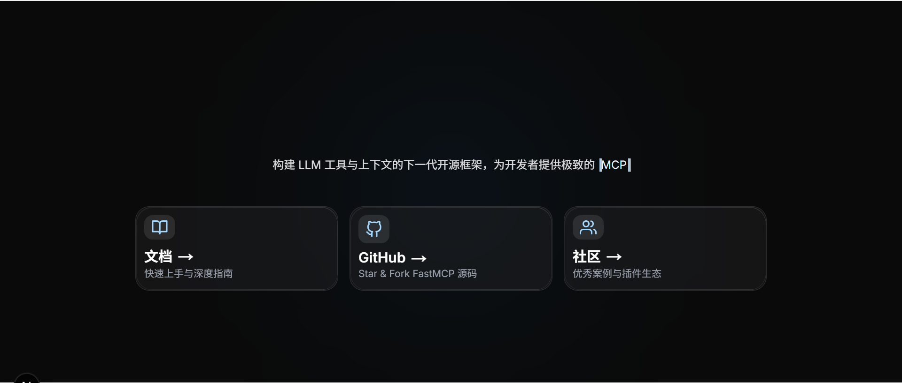

# FastMCP Tutorial



这是一个关于 fastMCP 中文版教程网站，是一个基于fastMCP原英文教程网站，然后通过Trae AI IDE进行vibe coding 出来的的一个中文版教程网站。后续作者会根据自己在原fastmMCP英文教程网站学习的笔记或者后续原教程更新的内容同步翻译到该网站上，欢迎各位观众老爷们前来观看

## ✨ 项目特点

- **完整文档**：涵盖MCP服务器、SDK、工具集成等全方位内容
- **交互式示例**：提供可直接运行的代码示例和教程
- **响应式设计**：适配桌面和移动设备的阅读体验
- **实时更新**：修改文档内容后自动刷新页面

## 🚀 快速开始

### 前提条件
- Node.js 18.x 或更高版本
- npm、yarn、pnpm 或 bun 包管理器

### 安装步骤

1. 克隆仓库
```bash
git clone https://github.com/chenrongjian/fastmcp-tutorial.git
cd fastmcp-tutorial
```

2. 安装依赖
```bash
npm install
# 或
yarn install
# 或
pnpm install
# 或
bun install
```

3. 启动开发服务器
```bash
npm run dev
# 或
yarn dev
# 或
pnpm dev
# 或
bun dev
```

4. 在浏览器中打开 [http://localhost:3000](http://localhost:3000) 查看网站

## 📚 文档内容

项目文档位于 `public` 目录下，主要包含以下类别：

- **入门指南**：`getting-started-*.md`
- **客户端开发**：`clients-*.md` 和 `sdk-client-*.md`
- **服务器开发**：`servers-*.md` 和 `sdk-server-*.md`
- **工具集成**：`integrations-*.md`
- **教程**：`tutorials-*.md`

## 🔧 开发指南

### 修改文档
1. 编辑 `public` 目录下的 Markdown 文件
2. 页面会自动刷新以反映更改

### 添加新文档
1. 在 `public` 目录下创建新的 Markdown 文件
2. 更新导航配置（位于 `src/lib/constants.ts`）

## �部署

推荐使用 Vercel 部署本项目：

1. 推送代码到 GitHub 仓库
2. 在 [Vercel](https://vercel.com) 导入项目
3. 等待自动部署完成

## 🤝 贡献

欢迎通过以下方式贡献：
- 提交 Issue 报告问题或建议
- 提交 Pull Request 改进文档或代码
- 在社区分享使用经验

## 📄 许可证

本项目采用 MIT 许可证 - 详见 [LICENSE](LICENSE) 文件

---

Made with ❤️ by Chenrongjian and Trae
